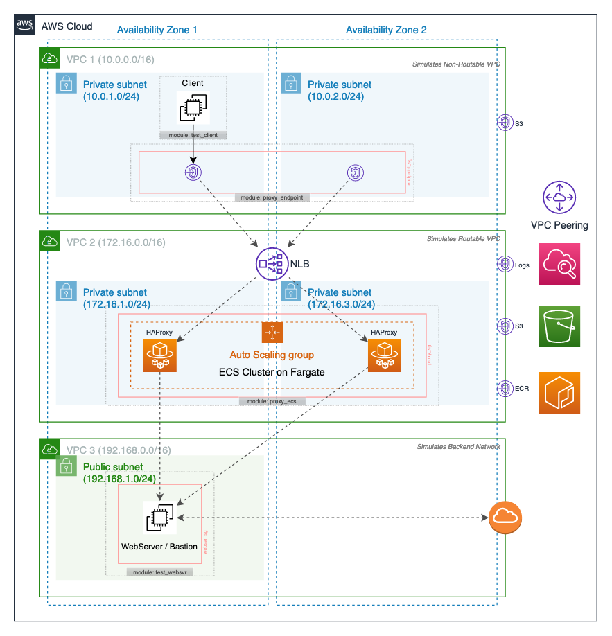

# Private Network Routing from AWS to On-Premise

## Overview

This repo offers an example of how network connections can be securely routed from an AWS 
VPC to a backend network (such as an on-premise network) using a TCP proxy. This may be 
needed in scenarios such as when the backend network uses public IP address space, or 
when destination network address translation (DNAT) is required. AWS offers a managed NAT
Gateway, but that supports source network address translation (SNAT) only, does not work 
across VPCs and requires an Internet Gateway (which may be restricted due to security and 
compliance reasons). TCP proxy is therefore often an essential component of an application's
networking infrastructure. See the simple diagram below for an illustration of how TCP proxy
can help with network routing: 

_Without a proxy:_
<pre>
          (cannot route)
Client  ------- ... -------> Server
</pre>

_Using a TCP proxy:_
<pre>
Client ----> TCP Proxy ----> Server
</pre>

TCP proxy here is implemented using the popular open-source [HAProxy](//www.haproxy.org/) 
load balancer. HAProxy is a lightweight and high-performance L4 TCP proxy with a rich set 
of features, including support for DNS based backend hostnames. 

This repo uses `Terraform` to deploy the proxy infrastructure on AWS. It also uses `Packer`
to create custom EC2 AMI, as well as to build and deploy Docker container image for 
HAProxy. Refer to [Installation](#Installation) section for more details. 

&nbsp;
## Modules 

This repo offers several Terraform modules to assist with deployment and testing. These 
modules are meant to be used as reference implementations only, and should be customized 
before using in a real project environment. The root module (i.e. top level Terraform 
configurations) sets up VPCs and basic networking, and then calls all other Terraform 
modules located in `tf_modules` directory using reference variable values in order to setup
a fully working demo environment. The demo environment looks similar to the diagrams shown
in the next section below. Here is a list of Terraform modules provided in this repo: 

| Module name | Doc page | Used to |
| --- | --- | --- |
| proxy_ec2 | [README](tf_modules/proxy_ec2/README.md) | deploy HAProxy on an EC2 cluster |
| proxy_ecs | [README](tf_modules/proxy_ecs/README.md) | deploy HAProxy on an ECS Fargate cluster |
| proxy_endpoint | [README](tf_modules/proxy_endpoint/README.md) | create a VPC endpoint to an HAProxy cluster |
| test_client | [README](tf_modules/test_client/README.md) | create a client instance for demo/testing purposes only|
| test_websvr | [README](tf_modules/test_websvr/README.md) | create a WebServer instance for demo/testing purposes only |
| _root module_ | [README](TFROOT.md) | setup a demo environment implementing all modules above |

&nbsp;
## Diagrams

HAProxy can be deployed using either `ECS on Fargate cluster` or `EC2 Auto Scaling cluster` module,
depending on preference and project complexity. The diagrams below shows a reference networking 
and infrastructure setup for each deployment scenario: 

| HAProxy on ECS Fargate cluster | HAProxy on EC2 cluster |
| :---: | :---: |
| [Figure 1](docs/images/diagram_haproxy_ecs_fargate.png)<br> | [Figure 2](docs/images/diagram_haproxy_ec2.png)<br> |
| Primary module: [proxy_ecs](tf_modules/proxy_ecs/) | Primary module: [proxy_ec2](tf_modules/proxy_ec2/) |
| Ideal for:<br><li>smaller number of proxy rules (1 - 10 rules)<li>where serverless deployments is preferred | Ideal for:<br><li>larger number of proxy rules (11 - 50 rules)<li>lower cost by deploying fewer resources |

&nbsp;
## Installation

Follow these steps to get up and running with a fully working demo environment: 

### 0. Prerequisite software tools and AWS account setup

Before you can start working with the Terraform code provided here, you must have a few 
software tools installed on your local workstation or build server. These are:

- [Terraform CLI](https://learn.hashicorp.com/tutorials/terraform/install-cli) 
- [Packer CLI](https://learn.hashicorp.com/tutorials/packer/getting-started-install)
- [AWS CLI](https://docs.aws.amazon.com/cli/latest/userguide/install-cliv2.html)
- [Git](https://git-scm.com/book/en/v2/Getting-Started-Installing-Git)

You also need an AWS account ([signup here](https://aws.amazon.com/free/free-tier/) for a 
free tier account if you don't already have one). 

Optionally, if SSH access into EC2 instances is required, then ensure that your AWS account 
has an EC2 key pair created. You can follow the [steps here](https://docs.aws.amazon.com/AWSEC2/latest/UserGuide/ec2-key-pairs.html) 
to either create a new key pair or upload an existing one. 

Finally, you must have AWS CLI configured to access your AWS account. 

> :information_source: If you're new to AWS CLI, you can follow the quickstart 
[steps here](https://docs.aws.amazon.com/cli/latest/userguide/cli-configure-quickstart.html). 
Creating a [named profile](https://docs.aws.amazon.com/cli/latest/userguide/cli-configure-profiles.html) 
is recommended for Terraform use. 

### 1. Clone this repo

Open a Terminal, and run the following command from a directory where you want to download the repo code: 

`git clone git@github.com:asksac/PrivateRouting.git`

> :information_source: There are more ways of cloning a Github.com repo. For more details, 
refer to [this page](https://docs.github.com/en/free-pro-team@latest/github/creating-cloning-and-archiving-repositories/cloning-a-repository)

### 2. Customize variable values 

The root Terraform module defines a [set of variables](./TFROOT.md) with default values 
that may be customized based on your environment and account setup. You may override 
any variable's default value by creating an entry in `terraform.tfvars` file in the project 
directory. An example `terraform.tfvars` might look like this: 

```
aws_profile                 = "terraform" 
aws_region                  = "us-east-2"
app_name                    = "ProxyRouting"
app_shortcode               = "prt"
ec2_ssh_enabled             = true
ec2_ssh_keypair_name        = "my_ssh_keypair"
ecr_proxy_image_repo_name   = "haproxy-registry"
ecr_proxy_image_tag         = "latest"
```

Additionally, listen ports for test webserver instance, as well as proxy configuration 
rules and port mappings may be customized by directly editing [`locals.tf`](./locals.tf)
file. If left unchanged, test_websvr ec2 instance and both proxy modules created in the 
demo environment will listen on following ports: 

| WebServer Listner | WebServer Port(s) | Proxy Port(s) |
| --- | --- | --- |
| Nginx HTTP Server | 8080 - 8085 (http) | 8080 - 8085 (http) |
| Nginx HTTPS Server | 8443 (https) | 9443 (https) |
| Python HTTP Echo | 80 (http) | 7080 (http) |
| Python HTTPS Echo | 443 (https) | 7443 (https) |
| SSH daemon | 22 (cannot be changed) | 7022 |

### 3. Create an ECR repository 

Before executing the Terraform configurations and creating resources, an ECR repository 
must be created. This repository will store the HAProxy Docker container image that is 
created in the next step. To create, run the following commands: 

```shell 
terraform init 
terraform apply -target aws_ecr_repository.registry
```

The last command above will produce an output value named `ecr_registry_url`. Take note 
as it will be needed in the Packer variables file in the next step. 

### 4. Build HAProxy EC2 AMI and container image

Refer to the [build README page](build/README.md) for detailed instructions on building EC2 
AMI and Docker container image containing HAProxy. 

### 5. Execute Terraform configuration

You're now ready for final installation step, which is to run the entire Terraform 
configuration (i.e. deploy the root module). Run the following command from Terminal:

```shell
terraform apply
```

This will run the _plan_ phase of Terraform first, and output a list of resources that 
Terraform will create. After verifying, enter `yes` to proceed with resource creation. 
This step may take several minutes to complete, and longer if there are a large number 
of port mappings defined in `locals.tf` file. At the end, it will output several important 
configuration values that must be noted for testing and validation steps (next section). 

&nbsp;
## Testing the Demo Environment

Assuming Terraform configuration in the last step above completes successfully, you 
will have a demo environment in your AWS account consisting of an HAProxy running in 
an ECS cluster on Fargate, and another HAProxy running on an EC2 cluster with EC2 Auto 
Scaling. The output from running the Terraform configuration contains key details of 
your demo environment. The `endpoint_alias_dns` output values can be used to begin
testing your proxy. 

If you have enabled SSH access in your EC2 instances, you may logon to test_client 
instance by following these steps: 

1. First, login to the test_websvr instance, which also serves as a bastion host: 

```shell
ssh -A -i my_ssh_key.pem ec2-user@<webserver_details/public_dns>
```

2. Next, jump to test_client instance: 

```shell
ssh -A ec2-user@client.prt.internal # ec2-user@<client_details/alias_dns>
```

3. Finally, send HTTP/S requests to test_websvr through both proxies: 

```shell
# test Python echo server through ec2 proxy
curl http://proxy-ec2-vpce.prt.internal:7080/
curl -k https://proxy-ec2-vpce.prt.internal:7443/

# test Nginx webserver through ec2 proxy
curl http://proxy-ec2-vpce.prt.internal:8080/
curl -k https://proxy-ec2-vpce.prt.internal:8443/

# test Python echo server through ecs proxy
curl http://proxy-ecs-vpce.prt.internal:7080/
curl -k https://proxy-ecs-vpce.prt.internal:7443/

# test Nginx webserver through ecs proxy
curl http://proxy-ecs-vpce.prt.internal:8080/
curl -k https://proxy-ecs-vpce.prt.internal:8443/
```

&nbsp;
## Troubleshooting

### Useful commands

These commands are useful troubleshooting commands to run on the HAProxy EC2 instance: 

- Login to ECR: `aws ecr get-login-password --region <region> | docker login --username AWS --password-stdin <accountid>.dkr.ecr.<region>.amazonaws.com`
- Pull container image: `docker pull <accountid>.dkr.ecr.us-east-1.amazonaws.com/haproxy-registry:latest`
- List docker images: `docker images`
- Start a docker container: `docker run -d --rm --ulimit nofile=10000:10000 -p 88:8888 <accountid>.dkr.ecr.us-east-1.amazonaws.com/haproxy-registry:latest`
- List running containers: `docker container ps`
- SSH into a container: `docker exec -it <container_id> /bin/sh`

### Helpful links

- HAProxy refreshing DNS cache and retrying backend: https://serverfault.com/questions/666600/haproxy-does-not-recover-after-failed-check 

### Notes

The version of `haproxy` found in Amazon Linux 2 core repo is a bit outdated, as seen in output below: 

```shell
$ yum info haproxy
Loaded plugins: priorities, update-motd, upgrade-helper
Available Packages
Name        : haproxy
Arch        : x86_64
Version     : 1.5.18
Release     : 9.amzn2
Size        : 831 k
Repo        : amzn2-core/2/x86_64
Summary     : TCP/HTTP proxy and load balancer for high availability environments
URL         : http://www.haproxy.org/
License     : GPLv2+
...
```

A newer version of `haproxy` can be found in `amazon-extras` repo, as seen below, however
this version too is old and has several known bugs: 

```shell
$ sudo amazon-linux-extras enable haproxy2
  0  ansible2                 available    \
 ... 
 45  haproxy2=latest          enabled      [ =stable ]
 ...

$ yum info haproxy2
Loaded plugins: priorities, update-motd, upgrade-helper
Installed Packages
Name        : haproxy2
Arch        : x86_64
Version     : 2.1.4
Release     : 1.amzn2.0.1
Size        : 5.2 M
Repo        : installed
From repo   : amzn2extra-haproxy2
Summary     : HAProxy reverse proxy for high availability environments
URL         : http://www.haproxy.org/
License     : GPLv2+
...
```

As a result, HAProxy container image used in this project is based on the official HAProxy 
image published on [Docker Hub](https://hub.docker.com/_/haproxy). If you do not have 
Internet access from the Packer build machine, you can manually pull the Docker Hub image 
from a machine with Internet access, then push the image onto a private registry such as 
Amazon ECR, and then edit `build/docker_build.pkr.hcl` to point to your private image repo. 

### Test WebServer and TLS certificates

The test_websvr module deploys an EC2 instance with a Python based echo server, as well as
Nginx webserver. The Python echo server is helpful for testing and troubleshooting purposes. 
Source code for the Python echo server can be found in [src/webapp](./src/webapp) folder. To 
view cli options for running the Python echo server, execute `python3 server.py -h`. 

If HTTPS port is enabled on either Python echo server or Nginx webserver, then a TLS private 
key and certificate is required. The repo contains a demo private key and self-signed cert, 
which is generated by running the following command: 

```shell
openssl req -x509 -nodes -newkey rsa:1024 -keyout config/ssl/key.pem -out config/ssl/cert.pem \
  -days 1825 -subj "/C=US/ST=IL/L=Chicago/O=Amazon.com, Inc./OU=Amazon Web Services/CN=aws.amazon.com"
```

> :warning: Never use the demo private key and self-signed certificate from this repo in 
an actual project environment. 

> :warning: As the key/cert are used for demo purposes only, it is acceptable to generate 
private key file with no password (-nodes), self-signed certificate with a longer expiration 
(-days 1825) and use fake certificate details (-subj), as shown above. However, these 
settings must never be used to generate TLS certificates in an actual project environments, 
or you risk severely compromising security of your environment. 

&nbsp;
## License

[](http://badges.mit-license.org)

- **[MIT license](http://opensource.org/licenses/mit-license.php)**
- Copyright 2020 &copy; Sachin Hamirwasia
