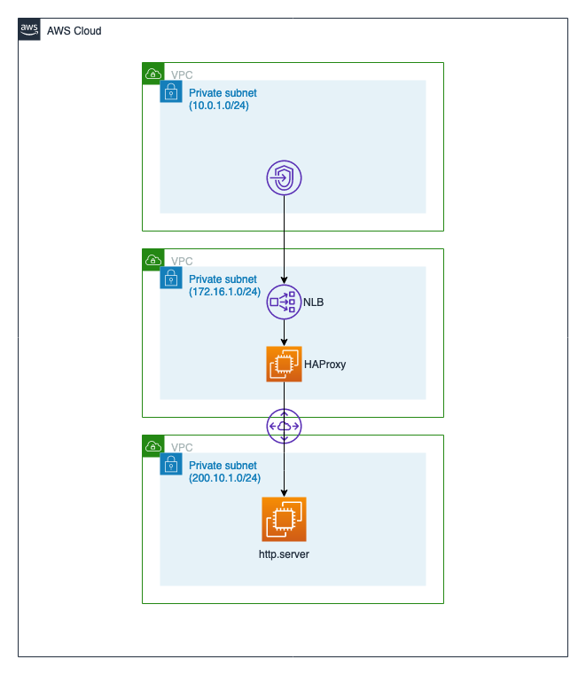

# Private Network Routing from AWS to On-Premise

## Overview

This repo offers an example of how network connections can be securely
routed from an AWS VPC to any external network that uses public IP addresses, 
using a cluster of HAProxy deployed on AWS Fargate or on a cluster of EC2 instances.  

HAProxy is used here as a lightweight and highly performant L4 TCP proxy that 
supports DNS based backend hostnames. 


## Diagram

The diagram below shows how networking and infrastructure is setup in this
project: 




## Deployment

### 1. Build the AMI and ECS Container Image

Refer to [this page](build/README.md) for instructions on building AMI and 
Docker container image. 

## Limitations 

The current design has a few limitations to be aware of. 

#### HAProxy on Amazon ECS on AWS Fargate
- A maximum of 5 proxy config rules can be defined in a single cluster
- Updating proxy config causes entire ECS Service to be destroyed and recreated, 
resulting in some downtime
- HAProxy configuration must be less than 8kb in size (that should never be an issue
as a maximum of 5 rules are supported at the moment)


## Troubleshooting

### Useful commands

- Login to ECR: `aws ecr get-login-password --region <region> | docker login --username AWS --password-stdin <accountid>.dkr.ecr.<region>.amazonaws.com`
- Pull container image: `docker pull <accountid>.dkr.ecr.us-east-1.amazonaws.com/prt-registry:1.0`
- List docker images: `docker images`
- Start a docker container: `docker run -d --rm --ulimit nofile=10000:10000 -p 88:8888 <accountid>.dkr.ecr.us-east-1.amazonaws.com/prt-registry:1.0`
- List running containers: `docker container ps`
- SSH into a container: `docker exec -it <container_id> /bin/sh`
- Set SSM Parameter: `export HAPROXY_CONFIG=$(aws ssm get-parameters --name /PrivateRouting/HAPROXY_CONFIG --region us-east-1 --query Parameters[0].Value --output text)`

### Important links

- Refresh DNS cache and retrying backend: https://serverfault.com/questions/666600/haproxy-does-not-recover-after-failed-check 


## Notes

The version of `haproxy` found in Amazon Linux 2 core repo is a bit outdated, as seen in output below: 

```shell
$ yum info haproxy
Loaded plugins: priorities, update-motd, upgrade-helper
Available Packages
Name        : haproxy
Arch        : x86_64
Version     : 1.5.18
Release     : 9.amzn2
Size        : 831 k
Repo        : amzn2-core/2/x86_64
Summary     : TCP/HTTP proxy and load balancer for high availability environments
URL         : http://www.haproxy.org/
License     : GPLv2+
...
```

However, a newer version of `haproxy` can be found in `amazon-extras` repo, as seen below: 

```shell
$ sudo amazon-linux-extras enable haproxy2
  0  ansible2                 available    \
 ... 
 45  haproxy2=latest          enabled      [ =stable ]
 ...

$ yum info haproxy2
Loaded plugins: priorities, update-motd, upgrade-helper
Installed Packages
Name        : haproxy2
Arch        : x86_64
Version     : 2.1.4
Release     : 1.amzn2.0.1
Size        : 5.2 M
Repo        : installed
From repo   : amzn2extra-haproxy2
Summary     : HAProxy reverse proxy for high availability environments
URL         : http://www.haproxy.org/
License     : GPLv2+
...
```

> :bell: Note: The HAProxy Docker container image used in this project is based on the image published on . If you do not have Internet access, you will need to pull the Docker Hub image from a machine with Internet access and then push the image to a private registry such as Amazon ECR. 

To generate a self-signed SSL certificate required to run `server.py` with `--tls` flag, run the 
following command: 

```shell
openssl req -x509 -nodes -newkey rsa:1024 -keyout config/ssl/key.pem -out config/ssl/cert.pem \
  -days 1825 -subj "/C=US/ST=IL/L=Chicago/O=Amazon.com, Inc./OU=Amazon Web Services/CN=aws.amazon.com"
```

*As this is for testing purposes only, we are generating the private key file with no password (-nodes), 
using a longer duration (-days 1825) and using dummy certificate details (-subj)*


## License

[](http://badges.mit-license.org)

- **[MIT license](http://opensource.org/licenses/mit-license.php)**
- Copyright 2020 &copy; Sachin Hamirwasia
