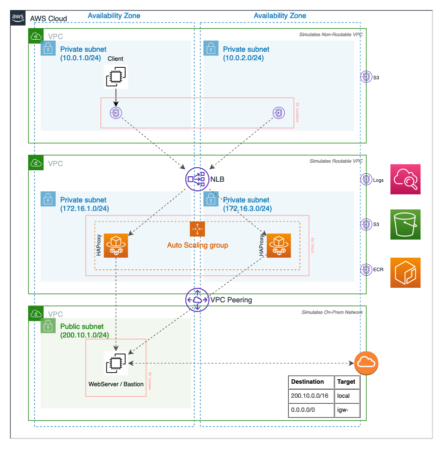

# Private Network Routing from AWS to On-Premise

## Overview

This project offers an example of how network connections can be securely
routed from an AWS VPC to an external network that uses public IP address
space via a Virtual Private Gateway or VPC peering. 

## Diagram

## Deployment

### 1. Build the AMI

## License

- **[MIT license](http://opensource.org/licenses/mit-license.php)**
- Copyright 2020 &copy; Sachin Hamirwasia
